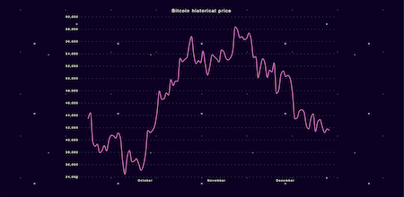
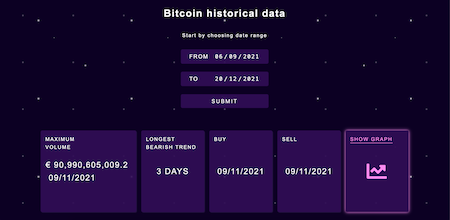

# Vincit Rising Star 2021 pre-assignment

This is a solution to the [Vincit Rising Star 2021 pre-assignment](https://vincit.fi/risingstar/Vincit_Rising_Star_2021-Pre-assignment.pdf). 

## Table of contents

- [Overview](#overview)
  - [The challenge](#the-challenge)
  - [Screenshot](#screenshot)
  - [Links](#links)
- [My process](#my-process)
  - [Built with](#built-with)
- [Author](#author)

## Overview

### The challenge

[See the requirements for the solution here](https://vincit.fi/risingstar/Vincit_Rising_Star_2021-Pre-assignment.pdf)

### Screenshot

### Links

- Live Site URL: [https://bitcoin-statistics.netlify.app/](https://bitcoin-statistics.netlify.app/)

## My process

### Built with

- Semantic HTML5 markup
- CSS custom properties
- CSS animations
- Flexbox
- Mobile-first workflow
- [D3.js](https://d3js.org/) - JS data vizualisation library   

## Author

[Keijo Prunt](https://www.linkedin.com/in/keijo-prunt-b7aaa1205/)

